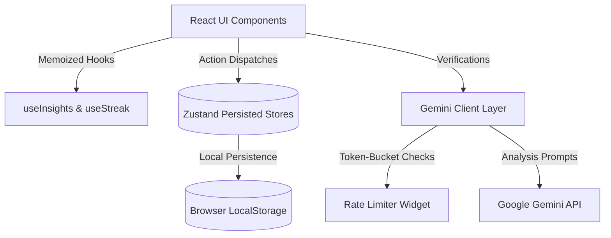

# ZenPath System Architecture

This document provides a technical overview of the ZenPath architecture, state flows, and developer specifications.

---

## 🏗️ System Overview

ZenPath is a client-side single-page application (SPA) built using React, TypeScript, and Vite. It is designed to run entirely inside the user's browser, eliminating the need for a dedicated backend server or remote database.

### Core Architectural Layers



1.  **State Management Layer**: Driven by **Zustand** using local storage persist middleware.
2.  **API Client Layer**: Powered by the official Google Gemini SDK (`@google/genai`), calling endpoints directly.
3.  **Analytics & Logic Layer**: Aggregates logs, calculates streaks, maps stress indices, and determines adaptive exercise options.
4.  **Security & Sanitization**: Strips HTML tags, locks down inputs, and weak-obfuscates keys to prevent shoulder-surfing.
5.  **Accessibility (WAI-ARIA)**: Screen-reader fallback data tables, W3C keyboard accessible tabs, and `aria-live` announcements.

---

## 📂 Project Directory Structure

```text
zenpath/
├── src/
│   ├── api/
│   │   ├── geminiClient.ts       # SDK client instance & test connection checker
│   │   ├── journalAnalysis.ts    # Journal CBT analysis dispatcher
│   │   ├── chatCompanion.ts      # Chat stream initializer
│   │   ├── weeklySummary.ts      # Weekly summary generation & 24h caching
│   │   └── zenquotes.ts          # Daily Quote engine & YYYY-MM-DD caching
│   ├── components/
│   │   ├── common/               # Badge, Button, Input, Modal, ErrorBoundary, EmptyState, OfflineBanner
│   │   ├── layout/               # Sidebar, TopBar, AppLayout shell
│   │   ├── insights/             # MoodTrendChart, TriggerChart, MoodDistribution, StressHeatmap
│   │   └── mindfulness/          # BreathingCircle (timers), MindfulnessCard (adaptive selectors)
│   ├── hooks/
│   │   ├── useChat.ts            # Typewriter stream typewriter hook
│   │   ├── useJournal.ts         # Save drafts & debounce autosave hook
│   │   ├── useInsights.ts        # Memoized dashboard stats selector
│   │   └── useStreak.ts          # Streak evaluator & dynamic canvas-confetti milestones
│   ├── pages/
│   │   ├── Onboarding.tsx        # 5-Step useReducer wizard setup
│   │   ├── Dashboard.tsx         # Stat panels & weekly reflections
│   │   ├── Insights.tsx          # 4-Tab ARIA dashboard analytics
│   │   ├── Journal.tsx           # Text editor, draft listings, & status checkers
│   │   ├── Chat.tsx              # Interactive therapeutic companion
│   │   └── Profile.tsx           # Settings, backups, & Connection testers
│   ├── store/
│   │   ├── userStore.ts          # Profile & btoa obfuscated keys
│   │   ├── journalStore.ts       # Entry list with soft deletes
│   │   ├── moodStore.ts          # Mood log history
│   │   └── chatStore.ts          # Chat dialogue threads
```

---

## 💾 State Management & Persistence

ZenPath uses partitioned Zustand stores saved to the browser's `localStorage` namespace:

*   **`zenpath-user`**: Stores the user's Profile payload and the Gemini API key. The key is saved as a base64 string using `btoa` and read with `atob`. This prevents cleartext inspection in devtools or over-the-shoulder lookups, though it is not cryptographically secure.
*   **`zenpath-journal`**: Keeps the list of journal entries. Soft delete is implemented via a `deletedAt: string | null` property to preserve the history for analytics while hiding deleted items from the active UI.
*   **`zenpath-mood`**: Tracks historical mood ratings (1-10) and emotion tags. Used to map long-term coping trends.
*   **`zenpath-chat`**: Persists conversation message streams between the student and Zen.

---

## 🤖 Google Gemini Integration

All GenAI features target `gemini-2.5-flash` due to its high speed and free tier availability.

### Rate Limiting (Token-Bucket)
To operate safely under the free tier limits (10 requests per minute), ZenPath includes a client-side sliding-window rate limiter in [rateLimiter.ts](file:///c:/Users/Admin/OneDrive/Desktop/MentalWellness/src/utils/rateLimiter.ts):
*   Allows up to 8 requests per minute (2 slots buffered to prevent network latency overlaps).
*   Tracks requests in a sliding timestamp queue.
*   Throws a descriptive `RateLimitError` indicating how many seconds to wait if the budget is exhausted.

### Input Sanitization
To prevent prompt injection, [sanitize.ts](file:///c:/Users/Admin/OneDrive/Desktop/MentalWellness/src/utils/sanitize.ts) strips all HTML/script tags from user-provided input before it is sent to the Gemini SDK.

---

## 🧘 Adaptive Mindfulness & Quotes

### Selection Rules
The mindfulness engine evaluates the following context metrics to assign an exercise:
*   **Mood Score < 4.5**: Recommends **4-7-8 Breathing** to quickly lower physical distress.
*   **Days to Exam < 15**: Recommends **5-4-3-2-1 Grounding** to ground focus in the present.
*   **Heavy Exams (UPSC, GATE, CAT) or study worries**: Recommends **Pomodoro Reset** to relieve syllabus pressure.
*   **Social & Expectation Worries**: Recommends **Gratitude Reframe** to focus on self-worth separate from scores.

### Daily Quotes Caching
The quote of the day is cached in `localStorage` under `zenpath-daily-quote`. The system generates a YYYY-MM-DD date key; it changes the quote only when the calendar day changes.

---

## ♿ Accessibility Compliance (WCAG AA)

We build ZenPath to be accessible to all students, including those using assistive technologies:

*   **Visual-Hidden Fallback Tables**: Recharts components lack screen reader support. Every chart has a corresponding visual-hidden table element (hidden via CSS `.sr-only`) containing the raw tabular data.
*   **Keyboard Accessible Tabs**: The tabs in the Insights dashboard follow W3C patterns. Focus shifts via the arrow keys, and selection triggers via the Enter/Space keys.
*   **Dynamic Screen Reader Announcements**: The breathing circle uses `aria-live="polite"` to read counting and breathing stages ("Inhale", "Hold", "Exhale") as they occur.

---

## 🧪 Testing Environment

ZenPath's tests are written using **Vitest** and run inside **jsdom**.
*   **Timers Mocking**: Uses `vi.useFakeTimers()` to test sliding-window rate limits and cache timeouts.
*   **Zustand Mocking**: Resets stores before tests to ensure test isolation.
