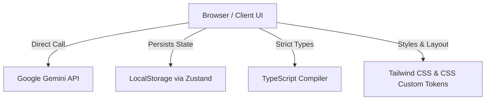

# ZenPath — AI Mental Wellness Tracker for Students

ZenPath is a client-only React web application powered by Google Gemini, designed to help students preparing for high-pressure competitive exams (like NEET, JEE, CUET, CAT, GATE, and UPSC) track their stress, journal their thoughts, and manage preparation anxiety.

---

## 🎨 Design Philosophy & Default Settings

*   **Default Dark Mode (`#0D1117` base)**: ZenPath defaults to a deep ink dark mode. This design choice is deliberate, recognizing that students frequently study late at night under low light. A dark interface significantly reduces eye strain and visual fatigue.
*   **Theme and Accessibility**: The color scheme uses contrast-calibrated tokens supporting a high WCAG accessibility standard.
*   **Color Theme Preferences**: The application is dark-mode by default; light mode is planned as a future enhancement.

---

## 🛠️ Architecture & How It Works

ZenPath is built as a **frontend-only** application. There is no server side or external database.



1.  **State Management**: App states (user profile details, journals, chat, mood logs) are stored locally in the browser using [Zustand](https://github.com/pmndrs/zustand) with `persist` middleware.
2.  **GenAI Companion**: AI analysis features call the Google Gemini SDK (`@google/genai`) directly from the browser context.
3.  **Sanitization & Validation**: All user text inputs are strictly sanitized via utility regexes in [sanitize.ts](file:///c:/Users/Admin/OneDrive/Desktop/MentalWellness/src/utils/sanitize.ts) before sending them to the Gemini client to block any potential prompt injections or script executions.
4.  **Client-Side Rate Limiter**: To prevent 429 quota exhaustion errors under Gemini's 10 requests per minute free tier constraint, ZenPath implements a sliding-window token-bucket rate limiter that checks constraints before every API dispatch.

---

## 🔒 Security Disclaimer

> [!WARNING]
> **API Key Protection Notice**: ZenPath does not utilize a backend server. The user enters their own Gemini API Key directly on the **Profile** screen.
> *   This key is stored in the browser's `localStorage` (inside the Zustand store).
> *   The key is obfuscated using `btoa` to prevent casual inspection or shoulder-surfing.
> *   **Limitation**: Obfuscation is NOT cryptographic encryption. Any script executing in the browser or anyone with local console access could read and decode the key using `atob`. We advise caution and using personal API keys with strict budget limits.

---

## 🔑 Getting Your Free API Key (No Credit Card)

1. Go to https://aistudio.google.com
2. Sign in with any Google account
3. Click "Get API key" → "Create API key in new project"
4. Copy the key
5. Paste it into ZenPath's Profile page (or configure `VITE_GEMINI_API_KEY` in `.env` for local dev)

### Free Tier Limits
- Model: Gemini 2.5 Flash
- 10 requests per minute
- 250 requests per day
- No credit card required
- No expiry

### What this means for ZenPath
- Each journal entry analysis = 1 API call
- Each chat message = 1 API call  
- Weekly summary = 1 API call (cached 24 hours)
- At normal usage (2-3 journal entries + 5-10 chat messages/day), you will comfortably stay within the free tier.

---

## 🚀 Setup & Execution

### 1. Requirements
- Node.js (v18.20.2 or higher)
- npm (v10.5.0 or higher)

### 2. Installation
Install the project dependencies:
```bash
npm install
```

### 3. Running Development Server
Launch the development server:
```bash
npm run dev
```

### 4. Running the Tests
Execute the Vitest test suite checking streak calculation, rate limiters, and response parsers:
```bash
npm run test
```

### 5. Production Compilation
Verify compilation builds:
```bash
npm run build
```
